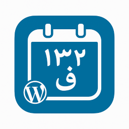

<div align="center">
  
  <h1>Persian Text and Date Converter</h1>
  <p><strong>Non-destructive, runtime conversion of Arabic characters, numbers, and Gregorian dates into standard Persian and Jalali formats for WordPress.</strong></p>

  [](https://wordpress.org/)
  [](https://php.net/)
  [](LICENSE)
  [](https://github.com/saeedtx)
</div>

---

## 🚀 Overview

**Persian Text and Date Converter** is a lightweight, non-destructive WordPress plugin tailored for Persian (Farsi) websites. 

Unlike legacy converters that run permanent database search-and-replace queries (risking data corruption and breaking serialized options), this plugin handles all transformations purely at the **presentation/runtime layer**. The underlying database remains completely untouched, ensuring total safety and instant revertability if disabled.

## ✨ Key Features

- **🛡️ 100% Non-Destructive:** Transforms content in real time across the frontend without modifying post records or database tables.
- **🔤 Arabic to Persian Character Normalization:** Converts Arabic letters (such as `ي` and `ك`) to standard Persian characters (`ی` and `ک`).
- **🔢 Digits Conversion:** Seamlessly converts English and Arabic numerals into standard Persian numbers (`۰ ۱ ۲ ۳ ۴ ۵ ۶ ۷ ۸ ۹`).
- **📅 Gregorian to Jalali (Shamsi) Date Conversion:** Automatically converts publication and comment dates into the Solar Hijri calendar using native WordPress date filters.
- **🌐 SEO & HTML Safe:** Intelligently isolates HTML tag attributes, script blocks, style tags, and URLs so that permalinks, image links, CSS classes, and sitemaps remain intact.
- **⚡ Broad Template Coverage:** Hooks cleanly into single posts, pages, post loops, archives, categories, search results, and comments.

## 🛠️ How It Works

The plugin hooks into WordPress core filters:
- Content and excerpt filters (`the_content`, `the_excerpt`, `the_title`, `comment_text`) for typography normalization.
- Date filters (`get_the_date`, `get_the_time`, `get_comment_date`, `get_comment_time`) for Jalali calendar translation.

HTML markup and URL attributes are protected via regular expression lookarounds and selective text-node replacements, preventing broken layout assets or corrupted hyperlinks.

## 📦 Installation

### From WordPress Dashboard:
1. Download the latest `.zip` release archive.
2. In your WordPress admin panel, navigate to **Plugins > Add New > Upload Plugin**.
3. Choose the `.zip` archive and click **Install Now**.
4. Click **Activate Plugin**.

### Via Git:
```bash
git clone [https://github.com/saeedtx/persian-text-and-date-converter.git](https://github.com/saeedtx/persian-text-and-date-converter.git) wp-content/plugins/persian-text-and-date-converter
```


⚙️ Requirements
WordPress: 5.3 or higher

PHP: 7.4 or higher

👤 Author
Saeed Tosifyan

Website: medseo.ir

LinkedIn: linkedin.com/in/saeedtx

📄 License
This plugin is free software licensed under the GNU General Public License v2.0 or later.

